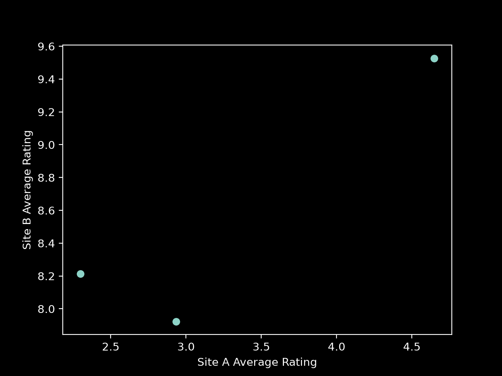
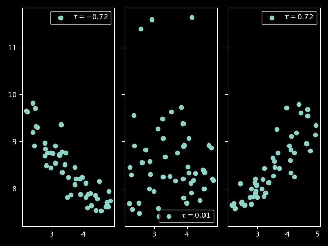
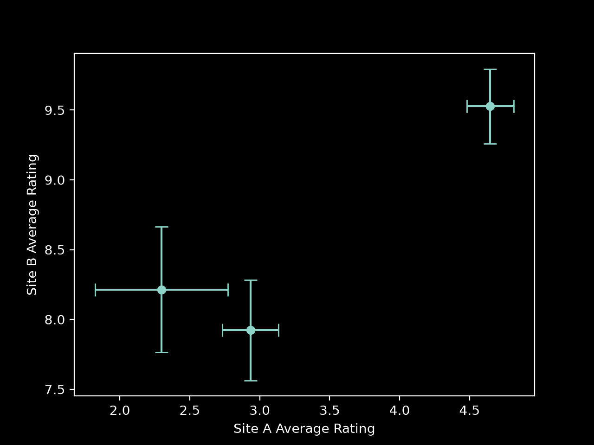
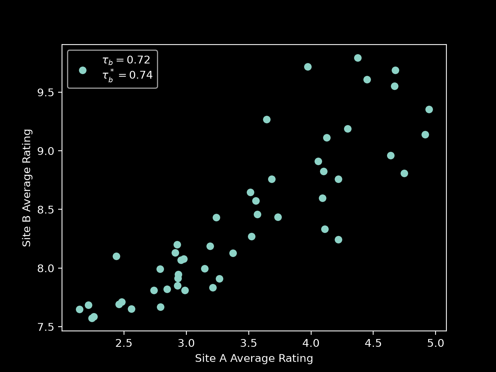

# Exploring Kendall's $\tau$

For one reason or another, I've been working with Kendall's $\tau$ lately. This post explores a little bit of my excitement with the statistic and some possible extensions. Disclaimer: I am not a statistician. 

The code used to created the plots in this blog can be found [here](https://github.com/iwhalen/kendall-tau-blog).

<!-- more -->

## Kendall who?

Wikipedia tells me [Sir Maurice George Kendall](https://en.wikipedia.org/wiki/Maurice_Kendall) was a statistician in the 20th century. Among other things, he was interested in rank correlations between to variables in the context of psychology. He wanted to quantify the similarity of two observers' rankings of quality of some events or individual.

For example, imagine we want to compare the rankings of movies between two different review sites. Maybe site A uses a 1 through 5 rating and site B uses a 1 through 10 rating. Let's say we compare 100 movies' ratings on both sites. Kendall's $\tau$ quantifies the "agreement" of the ranking of those movies from 1 to 100 based on both site's scores.

## Toy example

I'm sure this has been beaten into the ground elsewhere, but I like the math for this statistic. So I'm going to show a toy example.

Let's continue our movie comparison example. Let's say we just have three movies. Their rankings from each site are plotted below.

In this plot we have, approximately,

$$
\begin{align}
  x_1 &= 2.30 &~ y_1 &= 8.21 \\
  x_2 &= 2.93 &~ y_2 &= 7.92 \\
  x_3 &= 4.65 &~ y_3 &= 9.53 \\
\end{align}
$$

Looking at a single point doesn't tell us much about the ranking agreement. However, looking at pairs of points would tell us if the ranking of two movies is in agreement. Since we have three movies, there are $\binom{3}{2} = 3$ total pairs of points to compare.

First we can look at the ranking for movie 1 and 2.

- Site A has and average rating of $2.30$ and $2.93$ for movies 1 and 2, respectively.
- Site B has and average rating of $8.21$ and $7.92$ for movies 1 and 2, respectively.

We can see that the ordering doesn't match here. $2.30 < 2.93$ but $8.21 > 7.92$. The sites disagree on the ordering of these two pairs based on average rating. In other words, this pair is _discordant_.

On the other hand, if we look at the ranking for movie 1 and 3, we get a concordant pair for site A and B. Namely, 

If we look at all the other pairs of points, we get a total of 1 discordant and 2 concordant pairs. Explicitly, all three comparisons are:

| Pair | X comparison | Y comparison | Type |
|------|--------------|--------------|------|
| $\left[ (4.65, 9.53), (2.93, 7.92) \right]$ | $4.65 > 2.93$ | $9.53 > 7.92$ | Concordant |
| $\left[ (4.65, 9.53), (2.30, 8.21) \right]$ | $4.65 > 2.30$ | $9.53 > 8.21$ | Concordant |
| $\left[ (2.93, 7.92), (2.30, 8.21) \right]$ | $2.93 > 2.30$ | $7.92 < 8.21$ | Discordant |

So now we have these counts. Of course, the raw values don't tell us that much and don't let us compare across methods that might have different absolute counts.

Some measures we might care about could be concordance ratio ($0.67$) or discordance ratio ($0.33$). Kendall's $\tau$ combines these into a single number calculated by taking

$$
\frac{\text{# concordant pairs} - \text{# discordant pairs}}{\text{# pairs}}
$$

This value ranges from -1 (complete disagreement) to 1 (complete agreement). For our toy problem, $\tau = 0.33$.

Kendall's $\tau$ measures exactly what we would want in this kind of problem. This toy problem essentially walked through some first principal ideas behind the statistic. Namely, there's a bunch of pairs of points and we want to know how often they are properly ordered.

Below are some examples of what different plots might look like for various values of $\tau$[^bounds].

{style="display: block; margin: 0 auto"}

Anyone familiar with regular old correlation shouldn't be surprised by these plots.

## Math time

Now let's be annoying and fire up the ol' MathJax. 

There are a few ways to define Kendall's $\tau$. The easiest one we just looked at is the original definition, sometimes called Kendall's $\tau_a$. The set counting definition is very understandable. But we'll make it more explicit here.

First, we define the set of all combinations of indices as 

$$
P = \{(i, j) \mid 1 \leq i < j \leq n \}
$$

If we define our concordant pair set 

$$
C = \{ (i, j) \in P \mid (x_i - x_j)(y_i - y_j) > 0 \}
$$

and our discordant pair set 

$$
D = \{ (i, j) \in P \mid (x_i - x_j)(y_i - y_j) < 0 \}
$$

then

$$
\tau_a = \frac{|C| - |D|}{|P|}
$$

Note our simplification of the concordance and discordance logic. Instead of writing out individual inequalities, we simply write out $(x_i - x_j)(y_i - y_j)$, which will be positive if both $x_i > x_j$ and $y_i > y_j$ or both $x_i < x_j$ and $y_i < y_j$. This is the definition of concordance. The same idea holds for discordance.

However, we've clearly glossed over the case where $(x_i - x_j)(y_i - y_j) = 0$. 

## Let's call it a draw

In our movie example, its unlikely any two movies would have the same rating in each system. The two site's systems use different scales and are floating point values after averaging. However, in cases where Kendall's $\tau$ is used with integer values on the same scales, a ties can easily happen.

To account for this, Kendall whipped up a new version of his $\tau$. To continue our definitions, we'll need two new sets. Namely,

$$
\begin{align}
  T_x &= \{(i, j) \in P \mid x_i = x_j, y_i \neq y_j\} \\
  T_y &= \{(i, j) \in P \mid x_i \neq x_j, y_i = y_j \}
\end{align}
$$

Then, Kendall's $\tau_b$ that accounts for ties is calculated as:

$$
\tau_b = \frac{|C| - |D|}{\sqrt{|C \cup D \cup T_x||C \cup D \cup T_y|}}
$$

This $\tau_b$ has the same properties as regular old $\tau_a$. The only difference being that ties are properly handled. Before, ties in the data would cause $\tau_a$ to never be able to equal its boundaries, $[-1, 1]$. 

Now we have a definition we're happy with. Let's go back to our toy example. In reality, each point in our graph with three dots above is a point estimate. Its the average of all the ratings for a particular movie from each site. If we were so inclined, we could calculate something like a standard error or a bootstrap confidence interval for each point. Then, our plot would look something like this:

How could we incorporate this information into our definition?

## Significant other

A simple extension would be to have each of our concordance and discordance sets require that the comparison is significant[^note-on-definitions].

Of course, this needs a ton more mathematics. But we've come this far and can't turn back.

Suppose we have the observation $(x_i, y_i)$ defined with error terms, $s_{x_i}, s_{y_i}$, in both dimensions. Then, we can define the significance thresholds when compared to observation $(x_j, y_j)$ as

$$
\Delta_{ij}^x = \sqrt{s_{x_i}^2 + s_{x_j}^2}, \quad \Delta_{ij}^y = \sqrt{s_{y_i}^2 + s_{y_j}^2}
$$

Now we can expand the definitions of our concordant set and discordant set. First, we'll define the significantly ordered sets in each direction:

$$
\begin{align}
  X^+ &= \{ (i,j) \in P \mid x_i - x_j > \Delta_{ij}^x\} \\
  X^- &= \{ (i,j) \in P \mid x_i - x_j < -\Delta_{ij}^x\} \\
  Y^+ &= \{ (i,j) \in P \mid y_i - y_j > \Delta_{ij}^y\} \\
  Y^- &= \{ (i,j) \in P \mid y_i - y_j < -\Delta_{ij}^y\}.
\end{align}
$$

These sets will help us later on with other definitions. Then our significant concordant and discordant sets are:

$$
\begin{align}
  C^* &= \left( X^+ \cap Y^+ \right) \cup  \left( X^- \cap Y^- \right) \\
  D^* &= \left( X^+ \cap Y^- \right) \cup  \left( X^- \cap Y^+ \right).
\end{align}
$$

Where the $^*$ symbol is used to denote the "significant" version of the set. In plain english $C^*$ is the union of the sets that agree significantly on both the $x$ and $y$ coordinates. Where $D^*$ is the union of the sets that disagree in one coordinate or the other. Now we can define our significant $\tau_a^*$ as:

$$
\tau_a^* =  \frac{|C^*| - |D^*|}{|P|}
$$

Maybe its obvious, but we've serious exacerbated our issue of not counting "ties". Before, with the regular $\tau_a$ definition, a tie was potentially rare. Only occurring on the off chance that one dimension took exactly the same values. Now, we've introduced an entire interval where ties can occur for each point. 

So, we'll need the equivalent significant $\tau_b$ formulation here. In the normal definition, we normalize by $\sqrt{|C \cup D \cup T_x||C \cup D \cup T_y|}$. The first term counts every pair that can be ordered in $y$, whether or not it can also be ordered in $x$. Likewise, the second term counts every pair that can be ordered in $x$. The geometric mean of those counts gives us a denominator that accounts for the number of usable comparisons in each dimension. This normalization excludes pairs tied in both dimensions as they give no information. 

In this case, we can define our concept of a "tie" as a pair that isn't significantly ordered in one dimension but is significantly ordered in the other. First, let's collect the pairs that aren't significantly different in each dimension:

$$
\begin{align}
  X^0 &= P \setminus \left(X^+ \cup X^-\right) \\
  Y^0 &= P \setminus \left(Y^+ \cup Y^-\right).
\end{align}
$$

Then the significant tie sets are

$$
\begin{align}
  T_x^* &= X^0 \cap \left(Y^+ \cup Y^-\right) \\
  T_y^* &= \left(X^+ \cup X^-\right) \cap Y^0.
\end{align}
$$

Pairs in $X^0 \cap Y^0$ are tied in both dimensions, so they don't tell us anything about agreement and are left out entirely. With that, we can finally write

$$
\tau_b^* = \frac{|C^*| - |D^*|}{\sqrt{|C^* \cup D^* \cup T_x^*||C^* \cup D^* \cup T_y^*|}}.
$$

This has the behavior we want. If every error term is zero, the significant sets collapse back to the regular sets and $\tau_b^*$ becomes $\tau_b$. As uncertainty grows, fewer pairs count as ordered. The remaining pairs determine the direction of the statistic, while the denominator keeps ties in one dimension from being treated as outright disagreement.

Let's simulate some more data and see how this turns out in our movie ranking example.

Here, we can see that $\tau_b^*$ is larger. This is because some discordant pairs were not _significantly_ discordant. As such, they were removed and the value increased. The opposite could also happen if two pairs were not significantly concordant.

Now we have a nice definition of Kendall's $\tau$ that incorporates the idea of significance into concordance. To add one more twist to this blog, let's look at our graph with error bars again.

It's true that stopping at significant comparisons is likely enough. However, any two intervals may have some overlap. There's some chance that our conclusion that they are significantly concordant or discordant is incorrect.

## A continuity error

Let's really get into it now. What if we could define some "continuous" $\tau$ that is only equal to $1$ or $-1$ in the case that _none_ of these intervals overlap. This value would get closer to $0$ the more uninformative the usual definition is and the more these intervals overlap. 

I'd be lying if I said I could come up with this kind of thing all on my own, but here's where I got with some help.

First we have to define the magnitude of separation between any two points:

$$
\begin{align}
  r_{ij}^x &= \min \left\{1, \frac{|x_i - x_j|}{s_{x_i} + s_{x_j}} \right\} \\
  r_{ij}^y &= \min \left\{1, \frac{|y_i - y_j|}{s_{y_i} + s_{y_j}} \right\}.
\end{align}
$$

If two points are separated by more than their error on both dimensions, these $r$ values will both be $1$. This means they will always be included in the sets we are about to define.

Next, we'll define two threshold values $u, v \in [0,1]$ and use them to redefine our sets $X^+$, $X^-$, $Y^+$, and $Y^-$ from above:

$$
\begin{align}
  X_u^+ &= \{ (i,j) \in P \mid x_i > x_j, r_{ij}^x > u \} \\
  X_u^- &= \{ (i,j) \in P \mid x_i < x_j, r_{ij}^x > u \} \\
  Y_v^+ &= \{ (i,j) \in P \mid y_i > y_j, r_{ij}^y > v \} \\
  Y_v^- &= \{ (i,j) \in P \mid y_i < y_j, r_{ij}^y > v \}.
\end{align}
$$

The discerning reader will already know we'd like to integrate over $u$ and $v$ to calculate this continuous $\tau$. To get there, we'll define our $C$ and $D$ sets again as well:

$$
\begin{align}
  C_{u,v} = \left( X_u^+ \cap Y_v^+ \right) \cup \left( X_u^- \cap Y_v^- \right) \\
  D_{u,v} = \left( X_u^+ \cap Y_v^- \right) \cup  \left( X_u^- \cap Y_v^+ \right).
\end{align}
$$

Now, for the finale, our continuous "soft-boundary" $\tau_a$: 

$$
\tau_a^{s} = \frac{1}{|P|} \int_0^1 \int_0^1 \left( |C_{u,v}| - |D_{u,v}| \right) \,du\,dv.
$$

Where our superscript $s$ denotes "soft". I feel like I'm larping a little bit at this point, so I'll pump the brakes[^no-more-math]. There are some immediate issues with this definition. 

First, normalizing by $|P|$ is wrong. If you played this definition out, you'd find the estimates to be _way_ smaller than a regular $\tau_a$. This is because values with overlapping errors don't have the chance to contribute fully to the calculation. A better normalization would include the $r_{ij}$ values. Even better, it have some analogous normalization like in the $\tau_b$ formulation. But again, I'm out over my skis here.

## Conclusion

Why would anyone use either of these? I find the continuous measure pretty hard to justify. Maybe in very small sample sizes?

However, I think the significant hard-boundary definition is worthwhile. Oftentimes Kendall's $\tau$ is used in scenarios where measurements have potentially large errors. 

For example, the TREC run datasets[^trec]. Each year has a new dataset that is used to evaluate numerous retrieval systems (let's say on NDCG@10). Any two years can be compared with Kendall's $\tau$ to see how "in agreement" the system rankings are across datasets. 

However, each NDCG@10 has some error on it. One could bootstrap the calculation across retrievals to get a 95% confidence interval. In this case, the $\tau^*$ definitions from above could be used to consider uncertainty in the rankings.

I'll bring back my footnote[^note-on-definitions] comment here and also say that I'm surprised how recent the Nikolakopoulos work is on this topic. Kendall's $\tau$ has been around since the 1940s and we're only now allowing for measurement uncertainty? This makes me feel the field is worth a little exploration. That or I missed a bunch of papers that were published earlier. I hope this blog inspires someone to do a little digging themselves! I am not statistically minded enough to get there alone.

Now I know what you're thinking... yes I am procrastinating going back to the long, difficult project that I am coding by hand. If you want to check it out, see my first blog post on [Zierra](./0014_zierra_1.md) and the repository linked there. I'd be lucky to finish it by the end of the year at this rate.

Thanks for following along if you humored me this far!

[^bounds]: I know some of these points break the 1-10 and 1-5 movie rating analogy.

[^note-on-definitions]: The remaining definitions from here on are modified from _Nikolakopoulos, S., Cator, E., & Janssen, M. P. (2023). Extending the Mann–Kendall test to allow for measurement uncertainty. Statistics, 57(3), 577–596_. You can see the preprint version [here](https://arxiv.org/pdf/2103.13248). Where the authors use the $\operatorname{sgn}$ function, I (with the help of my favorite large language model) modified the definitions to use set counting (e.g., [here](https://online.stat.psu.edu/stat509/lesson/18/18.3)) and a bivariate analysis. From the citations of the Nikolakopoulos article, it doesn't seem like anyone has done this yet. So perhaps there's room to follow up that work with a further analysis on two variables. For example, proving variances, normality, and simulation studies. I'd be faking it all the way if I tried with an LLM assisting me. Note that in the Nikolakopoulos paper, they use a fixed distance by which two values need to differ by. Here, we use significant differences instead. This probably is also worth examining closer even in the univariate case.

[^trec]: TREC, or the [Text Retrieval Conference](https://trec.nist.gov/), is a long running conference aimed at furthering search algorithms. I would argue their work has become more important with the rise of amateur retrieval practitioners (like myself) needing to implement RAG systems. Logically, the R in RAG is the most important part for an enterprise use case using data an LLM was not trained on. 

[^no-more-math]: The [codebase](https://github.com/iwhalen/kendall-tau-blog) for this post has a little bit more down the path of calculating these values. However, actually typing up the latex would make me a big phony. I was comfortable enough with the set-based definitions. But, unrolling the integral into a sum had me out past my depth. You can see the issues created by this definition there.